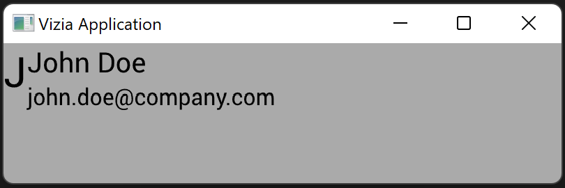

# Composing Views

Container views can contain other views and arrange them in a particular way. For example, the `VStack` container view will arrange its contents into a vertical column:

```rust
use vizia::prelude::*;

fn main() {
    Application::new(|cx|{
        VStack::new(cx, |cx|{
            
            Label::new(cx, "John Doe")
                .font_size(30.0);
            
            Label::new(cx, "john.doe@company.com");

        });
    })
    .run();
}
```


While a `HStack` container will arrange its contents into a horizontal row:

```rust
use vizia::prelude::*;

fn main() {
    Application::new(|cx|{
        HStack::new(cx, |cx|{
            
            Label::new(cx, "J")
                .font_size(30.0);
            
            VStack::new(cx, |cx|{
    
                Label::new(cx, "John Doe")
                    .font_size(20.0);
                
                Label::new(cx, "john.doe@company.com");
            });
        });
    })
    .inner_size((400, 100))
    .run();
}
```


We can style containers like any other view using style modifiers. For example, we can change the background color of the `hstack`:

```rust
use vizia::prelude::*;

fn main() {
    Application::new(|cx|{
        HStack::new(cx, |cx|{
            
            Label::new(cx, "J")
                .font_size(30.0);
            
            VStack::new(cx, |cx|{
    
                Label::new(cx, "John Doe")
                    .font_size(20.0);
                
                Label::new(cx, "john.doe@company.com");
            });
        })
        .background_color(Color::from("#EEEEEE"));
    })
    .inner_size((400, 100))
    .run();
}
```



<!-- The last argument to a container view is a closure with a `cx` argument, allowing for sub-views to be built into the container.

## The Event Loop

The concept of the view tree is important to understand when considering the flow of data and the order that operations occur.

A GUI application runs in a loop, called the event loop. Each cycle of the loop a number of Vizia systems run on the view tree, or parts of it, to update the UI. 

For example, each cycle, the application does the following: 

 - Process incoming events from the OS or from views
 - Determine changes in application data
 - Propagate changes to views bound to application data
 - Determine the styling and layout of views
 - Render the views to the screen. 
 
Some of these systems use caching to avoid running every cycle or run on only parts of the view tree. Additionally, this is not a full description of all of the systems that can run on the view each cycle. 

## The View Tree
Composing views together forms a tree, where each view has a single parent and zero or more children.

```rust
Application::new(|cx|{
    HStack::new(cx, |cx|{
        Label::new(cx, "Hello");
        Label::new(cx, "World");
    });
})
.run();
```

For example, for the code above the view tree can be depicted with the following diagram:

 -->

