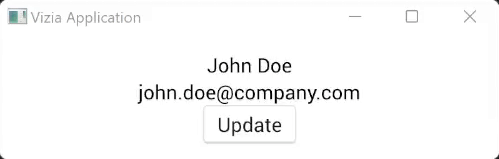

# Events

Events are used to communicate actions to update model or view data. 

Events propagate through the tree from origin to target, typically from the view which emits the event, up through the ancestors of the view, to the main window and through any models on the way.


## Declaring Events

An event contains a `Message`, which can be any type, typically an enum:

```rust
use vizia::prelude::*;

pub enum PersonEvent {
    UpdateName(String),
    UpdateEmail(String),
}
```

## Handling Events
Events are handled by views and models within the `event` method of the `View` or `Model` traits.

```rust
use vizia::prelude::*;

pub enum PersonEvent {
    UpdateName(String),
    UpdateEmail(String),
}

#[derive(Lens)]
pub struct Person {
    pub name: String,
    pub email: String,
}

impl Model for Person {
    fn event(cx: &mut Context, event: &mut Event) {
        event.map(|person_event, meta| match person_event {
            PersonEvent::UpdateName(new_name) => {
                self.name = new_name.clone();
            }

            PersonEvent::UpdateEmail(new_email) => {
                self.email = new_email.clone();
            }
        });
    }
}
```
Calling `map()` on an event attempts to cast the event message to the specified type and calls the provided closure if it succeeds. The closure provides the `Message` and a `EventMeta`, which can be used to consume an event to prevent it propagating further. 

Note that in the above  example the rust compiler is able to infer the message type from the match statement. 

## Sending Events
Events are usually emitted in response to some action on a view. For example, a button takes an action and a view to display. When the button is pressed the action is triggered, emitting an event up the tree.

```rust
use vizia::prelude::*;

pub enum PersonEvent {
    UpdateName(String),
    UpdateEmail(String),
}

#[derive(Lens)]
pub struct Person {
    pub name: String,
    pub email: String,
}

impl Model for Person {
    fn event(&mut self, cx: &mut Context, event: &mut Event) {
        event.map(|person_event, meta| match person_event {
            PersonEvent::UpdateName(new_name) => {
                self.name = new_name.clone();
            }

            PersonEvent::UpdateEmail(new_email) => {
                self.email = new_email.clone();
            }
        });
    }
}

fn main() {
    Application::new(|cx| {
        Person { 
            name: String::from("John Doe"), 
            email: String::from("john.doe@company.com") 
        }.build(cx);

        VStack::new(cx, |cx| {
            
            Label::new(cx, Person::name);
            Label::new(cx, Person::email);
            
            Button::new(
                cx,
                |cx| cx.emit(PersonEvent::UpdateName(String::from("Rob Doe"))),
                |cx| Label::new(cx, "Update"),
            );
        })
        .child_space(Stretch(1.0));
    })
    .run();
}
```

Running the app and then clicking on the button emits the event, which propagates up to the model and mutates the `name` field, which then updates the label which is bound to this field.




<!-- Events propagate through the view tree, and how an event propagates is specific to the event type. However, usually a platform event will propagate down the tree to the target view or model, and a user event will propagate up the tree to the target view or model. -->

