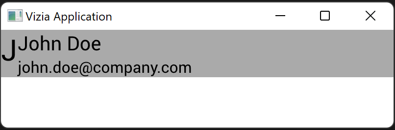
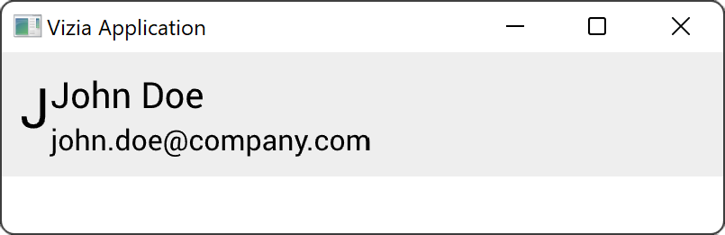
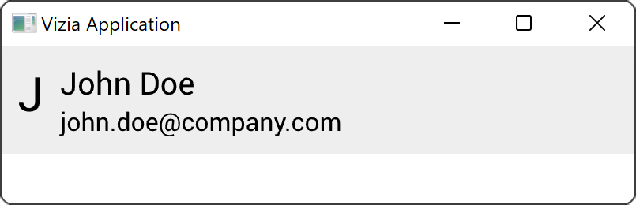

# Layout

The position and size of a view is determined by its layout properties.

By default, the width and height of a view are set to fill the available space.

To set a container to 'hug' its children, use `auto` units with the `width` or `height` modifiers. For example:

```rust
use vizia::prelude::*;

fn main() {
    Application::new(|cx|{
        HStack::new(cx, |cx|{
            
            Label::new(cx, "J")
                .font_size(30.0);
            
            VStack::new(cx, |cx|{
    
                Label::new(cx, "John Doe")
                    .font_size(20.0);
                
                Label::new(cx, "john.doe@company.com");
            });
        })
        .background_color(Color::from("#EEEEEE"))
        .height(Auto);
    })
    .inner_size((400, 100))
    .run();
}
```



The `child_space` modifier can be used to add padding between a view and its children:

```rust
use vizia::prelude::*;

fn main() {
    Application::new(|cx|{
        HStack::new(cx, |cx|{
            
            Label::new(cx, "J")
                .font_size(30.0);
            
            VStack::new(cx, |cx|{
    
                Label::new(cx, "John Doe")
                    .font_size(20.0);
                
                Label::new(cx, "john.doe@company.com");
            });
        })
        .background_color(Color::from("#EEEEEE"))
        .height(Auto)
        .child_space(Pixels(10.0));
    })
    .inner_size((400, 100))
    .run();
}
```


Similarly, the `col_between` modifier can be used to add space between children arranged in a row:

```rust
use vizia::prelude::*;

fn main() {
    Application::new(|cx|{
        HStack::new(cx, |cx|{
            
            Label::new(cx, "J")
                .font_size(30.0);
            
            VStack::new(cx, |cx|{
    
                Label::new(cx, "John Doe")
                    .font_size(20.0);
                
                Label::new(cx, "john.doe@company.com");
            });
        })
        .background_color(Color::from("#EEEEEE"))
        .height(Auto)
        .child_space(Pixels(10.0))
        .col_between(Pixels(10.0));
    })
    .inner_size((400, 100))
    .run();
}
```

