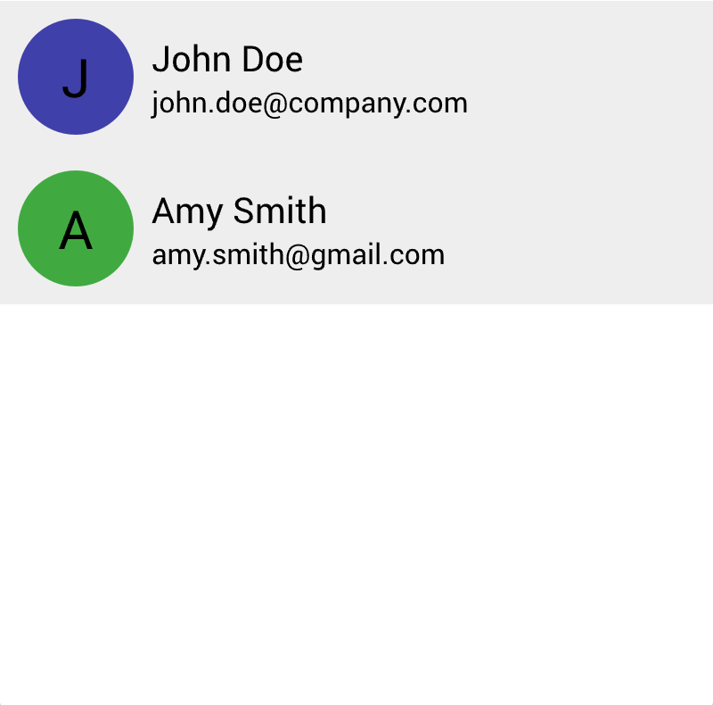

# List

<!-- Places the person view within a list of people. -->

The `List` view binds to a `Vec` of model data and presents the items in a column.

First, let's add a new model called `AppData` which contains a `Vec` of `Person` data.

```rust
#[derive(Lens)]
pub struct AppData {
    people: Vec<Person>,
}

impl Model for AppData {}
```

Next, we'll add the `List` view and pass it a lens to the vector of people. Then, we'll add the `PersonView` to the list constructor closure. The `List` iterates over the people in the bound vector and builds a `PersonView` for each item. 

The closure passed to the list constructor provides a context as well as an index and a lens to each item. We use this `item` lens, which has a target of `Person`, to construct the `PersonView`.

```rust

Application::new(|cx|{

    cx.add_theme(STYLE);

    AppData {
        people: vec![
            Person {
                name: String::from("John Doe"),
                email: String::from("john.doe@company.com"),
                color: Color::from("#4040AA"),
            },

            Person {
                name: String::from("Amy Smith"),
                email: String::from("amy.smith@gmail.com"),
                color: Color::from("#40AA40"),
            },
        ],
    }.build(cx);
    
    List::new(cx, AppData::people, |cx, index, item|{
        PersonView::new(cx, item);
    })
    .width(Stretch(1.0));
})
.inner_size((400, 400))
.run();

```

This produces the following output:


