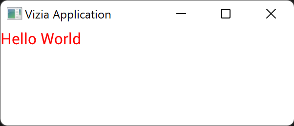

# View Modifiers

View modifiers allow for the properties of a view to be modified in a declarative way.

For example, we can set the font color of a `Label` with the following style modifier:

```rust
use vizia::prelude::*;

fn main() {
    Application::new(|cx|{
        Label::new(cx, "Hello World")
            .color(Color::red());
    })
    .run();
}
```



Modifiers for [style](./style_properties.md) and [layout](./layout_properties.md) properties are available for all views. However, some views have unique modifiers specific to themselves.