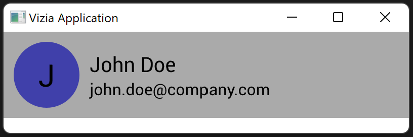

# Property Binding

A property binding updates just the style and layout properties of view in response to model data changes, instead of rebuilding the entire view. Most view modifiers accept a lens as input, which sets up a binding to the target data. 

Let's modify our contact example to use a property binding for the color of the profile icon. First, we add a color property to the model and remove the background color from the stylesheet. Then, we add a background color modifier to the profile icon label, but instead of a value we pass to the `Person::color` lens.

```rust
use vizia::prelude::*;

const STYLE: &str = r#"
    .profile_icon {
        height: 65px;
        width: 65px;
        child-space: 1s;
        border-radius: 50%;
    }
"#;

#[derive(Lens)]
pub struct Person {
    pub name: String,
    pub email: String,
    pub color: Color,
}

impl Model for Person {}

fn main() {
    Application::new(|cx|{

        cx.add_theme(STYLE);

        Person {
            name: String::from("John Doe"),
            email: String::from("john.doe@company.com"),
            color: Color::from("#4040AA"),
        }.build(cx);

        HStack::new(cx, |cx|{
            
            Label::new(cx, Person::name.map(|name| name.chars().next().unwrap()))
                .font_size(30.0)
                .background_color(Person::color)
                .class("profile_icon");
            
            VStack::new(cx, |cx|{
    
                Label::new(cx, Person::name)
                    .font_size(20.0);
                
                Label::new(cx, Person::email);
            })
            .top(Stretch(1.0))
            .bottom(Stretch(1.0));
        })
        .background_color(Color::from("#EEEEEE"))
        .height(Auto)
        .child_space(Pixels(10.0))
        .col_between(Pixels(10.0));
    })
    .inner_size((400, 100))
    .run();
}
```

