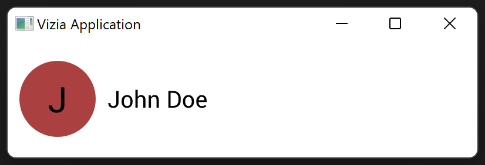

# Styling

Style modifiers can be used to set the properties of a view inline. However, stylesheets can be used to define shared style properties across multiple views.

Stylesheets use CSS rules to apply styling to multiple views simultaneously. A CSS string can be defined within a rust file as a constant, or within an external css file. 

To add a stylesheet which is already a string in rust code, use `cx.add_theme()` to add the stylesheet to the application. Here we use the `class()` modifier to add a class name to the first label.

```rust
use vizia::prelude::*;

const STYLE: &str = r#"
    .profile_icon {
        height: 65px;
        width: 65px;
        child-space: 1s;
        background-color: #AA4040;
        border-radius: 50%;
    }
"#;

fn main() {
    Application::new(|cx|{

        cx.add_theme(STYLE);

        HStack::new(cx, |cx|{
            
            Label::new(cx, "J")
                .font_size(30.0)
                .class("profile_icon");
            
            VStack::new(cx, |cx|{
    
                Label::new(cx, "John Doe")
                    .font_size(20.0);
                
                Label::new(cx, "john.doe@company.com");
            })
            .top(Stretch(1.0))
            .bottom(Stretch(1.0));
        })
        .background_color(Color::from("#AAAAAA"))
        .height(Auto)
        .child_space(Pixels(10.0))
        .col_between(Pixels(10.0));
    })
    .inner_size((400, 100))
    .run();
}
```



We set the `size` to be `65px`, the `background-color` to be red, and the border radius to `50%`, resulting in a circle. The `child-space` is set to `1s`, which is equivalent to `Stretch(1.0)` in rust code.

The `Stretch` unit will cause the space to fill a proportion of the parent free space. In this case, the parent free space is the parent size minus the text size, and the proportion is one, which results in equal spacing around the text and thus centers the text within the label.