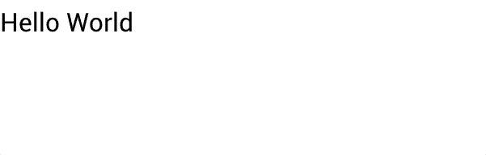

# Views
Views are used to visually present [model data](./models.md) and to act as controls which, when interacted with, send events to mutate model data. They are the building blocks of the GUI.

For example, the `Label` view is used to display a text string:

```rust
use vizia::prelude::*;

fn main() {
    Application::new(|cx|{
        Label::new(cx, "Hello World");
    })
    .run();
}
```



The first argument to the constructor is a mutable reference to `Context`, shortened to `cx`. This allows the view to build itself into the application and is ubiquitous to all views.


