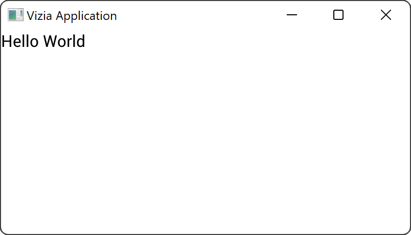
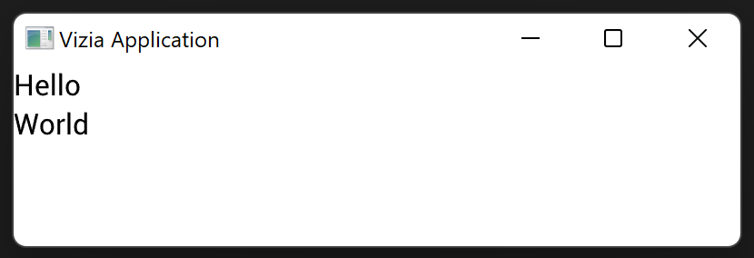
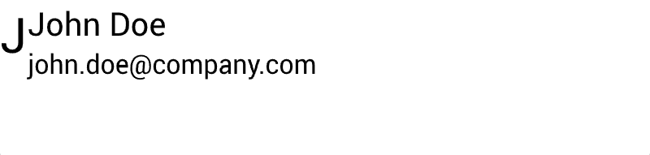
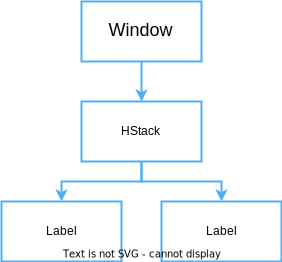

# Adding views

Views are the building bocks of a vizia GUI and are used to visually present [model data](./models.md) and to act as controls which, when interacted with, send events to mutate model data.

We'll learn more about models and events in the following sections.

## Declaring views

For example, we can declare a `Label` view to display a text string:

```rust
use vizia::prelude::*;

fn main() {
    Application::new(|cx|{
        Label::new(cx, "Hello World");
    })
    .inner_size((400, 200))
    .run();
}
```



The first argument to the `new()` method of the label is a mutable reference to `Context`, shortened to `cx`. This allows the view to build itself into the application and is passed from view to view.

# Composing views

Composition of views is achieved through container views, which typically take a closure which allows us to build child views within it. Some container views may arrange their content in a particular way.

For example, the `VStack` container view will arrange its contents into a vertical column:

```rust
use vizia::prelude::*;

fn main() {
    Application::new(|cx|{
        
        VStack::new(cx, |cx|{    
            Label::new(cx, "Hello");
            Label::new(cx, "World");
        });
    })
    .inner_size((400, 100))
    .run();
}
```


While a `HStack` container will arrange its contents into a horizontal row:

```rust
use vizia::prelude::*;

fn main() {
    Application::new(|cx|{
        
        VStack::new(cx, |cx|{
            Label::new(cx, "Hello");
            Label::new(cx, "World");
            
        });
    })
    .inner_size((400, 100))
    .run();
}
```




Composing views together forms a tree, where each view has a single parent and zero or more children. For example, for the code above the view tree can be depicted with the following diagram:



The Window is the *parent* of the HStack, while the HStack is the *parent* of both the Labels. Therefore, the Window is an *ancestor* of the Labels and the Labels are *descendants* of the window. This terminology is relevant when writing CSS style rules, which we'll cover later in this guide.