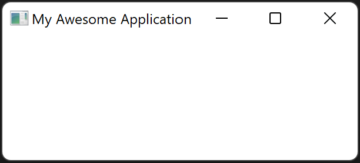

# Window Modifiers

When creating an `Application` the properties of the root window can be changed using [window modifiers](https://docs.vizia.dev/vizia/window/trait.WindowModifiers.html). These modifiers are methods called on the application prior to calling `run()`.

For example, to change the title of the root window:

```rust
use vizia::prelude::*;

fn main() {
    Application::new(|cx|{

    })
    .title("My Awesome Application")
    .run();
}
```


