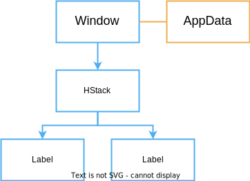

# Models

Application data in Vizia is stored in models. Views can then bind to the data in these models in order to react to changes in the data.

## Declaring Models

A model definition can be any type, typically a struct, which implements the `Model` trait:

```rust,ignore
pub struct Person {
    pub name: Signal<String>,
    pub email: Signal<String>,
}

impl Model for Person {}
```

## Building Models

A model definition can be built into the view tree with the `build()` method:

```rust,ignore
use vizia::prelude::*;

fn main() -> Result<(), ApplicationError> {
    Application::new(|cx|{
        Person {
            name: Signal::new(String::from("John Doe")),
            email: Signal::new(String::from("john.doe@company.com")),
        }.build(cx);

        HStack::new(cx, |cx|{
            Label::new(cx, "Hello");
            Label::new(cx, "World");
        });
    })
    .run();
}

```
This builds the model data into the tree, in this case at the root `Window`.

Internally, Vizia enforces a separation between views and models by storing them separately. However, for processes like event propagation, models can be thought of as existing within the tree, with an associated parent view.

The model-view tree for the above code can be depicted with the following diagram:



If the `AppData` had been built within the contents of the `HStack`, then the model would be associated with the `HStack` rather than the `Window`.

## Accessing Model Signals with `cx.data()`

When setup and usage are split across modules, you can read a model from context with `cx.data()` and copy the signal handle from it:

```rust,ignore
fn build_name_label(cx: &mut Context) {
    let name = cx.data::<Person>().name;
    Label::new(cx, name);
}
```

This works from anywhere in scope of the model and is useful when retrofitting existing code.

However, the preferred pattern is to create signals up front, pass them into the model before calling `build()`, and pass those same signals down to the views that need them:

```rust,ignore
use vizia::prelude::*;

fn main() -> Result<(), ApplicationError> {
    Application::new(|cx| {
        let name = Signal::new(String::from("John Doe"));
        let email = Signal::new(String::from("john.doe@company.com"));

        Person { name, email }.build(cx);

        HStack::new(cx, |cx| {
            Label::new(cx, name);
            Label::new(cx, email);
        });
    })
    .run();
}
```

Passing signal handles explicitly makes data flow easier to follow, avoids hidden dependencies, and keeps views more reusable.