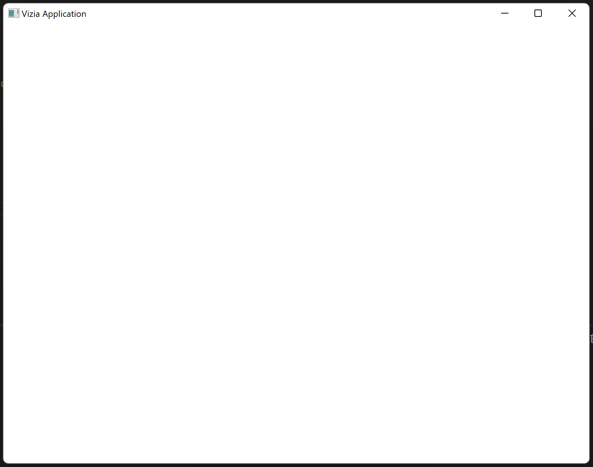

# Creating an Application

The first step to building a GUI with vizia is to create an application. Creating a new application creates a root window and a [`context`](https://docs.vizia.dev/vizia/context/struct.Context.html). Views declared within the closure passed to `Application::new()` are added to the context and rendered into the root window.

Add the following code to the `main.rs` file, replacing the hello world code that was generated for us:

```rust
use vizia::prelude::*;

fn main() {
    Application::new(|cx|{
        // Content goes here
    })
    .run();    
}
```
The `run()` method on the `Application` causes the program to enter the event loop and for the main window to display.

We can run our application with `cargo run` in the terminal, which should result in the following:

