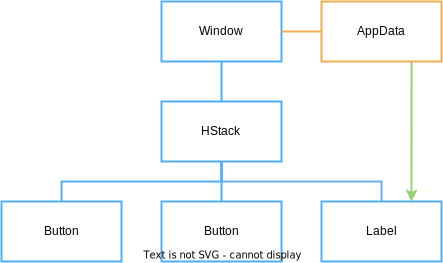

# Data Binding

Now that we have some model data we can *bind* the `count` to the `Label` view. 

Data binding is the concept of linking model data to views, so that when the model data is changed, the views observing this data update in response.

In Vizia, data binding is achieved through reactive values called Signals. In this quickstart flow, `count` is the reactive source used to bind the label to model state.


## Exposing bindable model fields

The model field we want to display (`count`) is stored as a `Signal<i32>`, so the signal handle can be passed directly to views and modifiers for binding:

```rust,ignore
pub struct AppData {
    count: Signal<i32>,
}

impl Model for AppData {}
```

This gives us a reactive signal handle for `count`.

## Binding the label

We can bind the `count` data to the `Label` by passing it in place of a string:

```rust,ignore
use vizia::prelude::*;

fn main() -> Result<(), ApplicationError> {
    Application::new(|cx|{

        let count = Signal::new(0);

        AppData { count }.build(cx);

        HStack::new(cx, |cx|{
            Button::new(cx, |cx| Label::new(cx, "Decrement"))
                .class("dec");
            Button::new(cx, |cx| Label::new(cx, "Increment"))
                .class("inc");
            Label::new(cx, count) // Bind the label to the count data
                .class("count");
        })
        .class("row");
    })
    .title("Counter")
    .inner_size((400, 100))
    .run()
}
```

This sets up a binding which updates the value of the label whenever the `count` signal is modified. We can depict this with the following diagram, where the green arrow shows the direct link between the data and the label:

<p align="center">

</p>

## Modifier bindings
Many modifiers also accept signals as well as a literal value. When a bindable value is supplied to a modifier, a binding is set up which updates the modified property when the model data changes. For example:

```rust,ignore
pub struct AppData {
    color: Signal<Color>,
}

...

Label::new(cx, "Hello World")
    .background_color(color);
```

