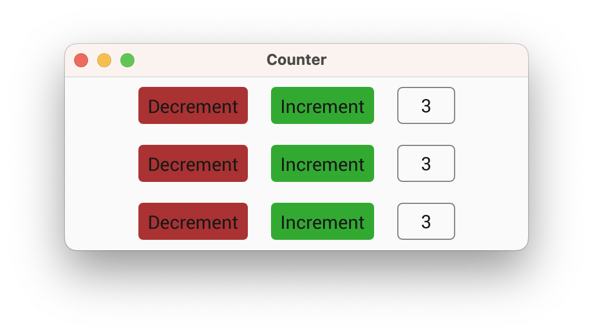

# Making the Counter Reusable

In this section we're going to turn our counter into a component by declaring a custom view. This will make our counter reusable so we can easily create multiple instances or export the counter as a component in a library.

## Step 1: Creating a custom view struct
First we declare a struct which will contain any view-specific state:

```rust,ignore
pub struct Counter {}
```

Although we could store the `count` value within the view, we've chosen instead to make this view 'stateless', and instead we'll provide it with a signal to bind to some external state (typically from a model), and some callbacks for emitting events when the buttons are pressed.

## Step 2: Implementing the view trait
Next, we'll implement the `View` trait for the custom counter view:

```rust,ignore
impl View for Counter {}
```

The `View` trait has methods for responding to events and for custom drawing, but for now we'll leave this implementation empty.

## Step 3: Building the sub-components of the view
Next we'll implement a constructor for the counter view. To use our view in a vizia application, the constructor must build the view into the context, which returns a `Handle` we can use to apply modifiers on our view.

```rust,ignore
impl Counter {
    pub fn new(cx: &mut Context) -> Handle<Self> {
        Self {

        }.build(cx, |cx|{

        })
    }
}
```

The `build()` function, provided by the `View` trait, takes a closure which we can use to construct the content of the custom view. Here we move the code which makes up the counter:

```rust,ignore
impl Counter {
    pub fn new(cx: &mut Context) -> Handle<Self> {
        Self {

        }.build(cx, |cx|{
            HStack::new(cx, |cx|{
                Button::new(cx, |cx| Label::new(cx, "Decrement"))
                    .on_press(|ex| ex.emit(AppEvent::Decrement))
                    .class("dec");

                Button::new(cx, |cx| Label::new(cx, "Increment"))
                    .on_press(|ex| ex.emit(AppEvent::Increment))
                    .class("inc");
                
                Label::new(cx, "0")
                    .class("count");
            })
            .class("row");
        })
    }
}
```
## Step 4: User-configurable binding

The label within the counter is currently bound to a specific signal, but to make the component truly reusable we need to pass a signal in via the constructor. We use a generic parameter with the `Res` trait, which allows passing any type that can be resolved to an `i32` value (signals, memos, constants, etc.):

```rust,ignore
impl Counter {
    pub fn new(cx: &mut Context, count: impl Res<i32>) -> Handle<Self> 
    {
        Self {

        }.build(cx, |cx|{
            HStack::new(cx, |cx|{
                Button::new(cx, |cx| Label::new(cx, "Decrement"))
                    .on_press(|ex| ex.emit(AppEvent::Decrement))
                    .class("dec");

                Button::new(cx, |cx| Label::new(cx, "Increment"))
                    .on_press(|ex| ex.emit(AppEvent::Increment))
                    .class("inc");
                
                Label::new(cx, count)
                    .class("count");
            })
            .class("row");
        })
    }
}
```

## Step 5 - User-configurable events

The last part required to make the counter truly reusable is to remove the dependency on `AppEvent`. To do this we'll add a couple of callbacks to the counter to allow the user to emit their own events when the buttons are presses. 

### Adding callbacks to the view

First, change the `Counter` struct to look like this:

```rust,ignore
pub struct Counter {
    on_increment: Option<Box<dyn Fn(&mut EventContext)>>,
    on_decrement: Option<Box<dyn Fn(&mut EventContext)>>,
}
```

These boxed function pointers provide the callbacks that will be called when the increment and decrement buttons are pressed. 

Before moving on, we need to assign initial field values to the Counter 
instance that was created earlier:

```rust,ignore
impl Counter {
    pub fn new(cx: &mut Context, count: impl Res<i32>) -> Handle<Self> 
    {
        Self {
            on_decrement: None,
            on_increment: None,
        }.build(cx, |cx|{
            HStack::new(cx, |cx|{
                Button::new(cx, |cx| Label::new(cx, "Decrement"))
                    .on_press(|ex| ex.emit(AppEvent::Decrement))
                    .class("dec");

                Button::new(cx, |cx| Label::new(cx, "Increment"))
                    .on_press(|ex| ex.emit(AppEvent::Increment))
                    .class("inc");
                
                Label::new(cx, count)
                    .class("count");
            })
            .class("row");
        })
    }
}
```

### Custom modifiers

Next we'll need to add some custom modifiers so the user can configure these callbacks. To do this we can define a trait and implement it on `Handle<'_, Counter>`:

```rust,ignore
pub trait CounterModifiers {
    fn on_increment<F: Fn(&mut EventContext) + 'static>(self, callback: F) -> Self;
    fn on_decrement<F: Fn(&mut EventContext) + 'static>(self, callback: F) -> Self;
}
```

We can use the `modify()` method on `Handle` to directly set the callbacks when implementing the modifiers:

```rust,ignore
impl<'a> CounterModifiers for Handle<'a, Counter> {
    fn on_increment<F: Fn(&mut EventContext) + 'static>(self, callback: F) -> Self {
        self.modify(|counter| counter.on_increment = Some(Box::new(callback)))
    }

    fn on_decrement<F: Fn(&mut EventContext) + 'static>(self, callback: F) -> Self {
        self.modify(|counter| counter.on_decrement = Some(Box::new(callback)))
    }
}
```

### Internal event handling

Unfortunately we can't just call these callbacks from the action callback of the buttons. Instead we'll need to emit some internal events which the counter can receive, and then the counter can call the callbacks. Define an internal event enum for the counter like so: 

```rust,ignore
pub enum CounterEvent {
    Decrement,
    Increment,
}
```

We can then use this internal event with the buttons:
```rust,ignore
Button::new(cx, |cx| Label::new(cx, "Decrement"))
    .on_press(|ex| ex.emit(CounterEvent::Decrement))
    .class("dec");

Button::new(cx, |cx| Label::new(cx, "Increment"))
    .on_press(|ex| ex.emit(CounterEvent::Increment))
    .class("inc");
```

Finally, we respond to these events in the `event()` method of the `View` trait for the `Counter`, calling the appropriate callback:

```rust,ignore
impl View for Counter {
    fn event(&mut self, cx: &mut EventContext, event: &mut Event) {
        event.map(|counter_event, meta| match counter_event{
            CounterEvent::Increment => {
                if let Some(callback) = &self.on_increment {
                    (callback)(cx);
                }
            }

            CounterEvent::Decrement => {
                if let Some(callback) = &self.on_decrement {
                    (callback)(cx);
                }
            }
        });
    }
}
```

To recap, now when the user presses on one of the buttons, the button will emit an internal `CounterEvent`, which is then handled by the `Counter` view to call the appropriate callback, which the user can set using the custom modifiers we added using the `CounterModifiers` trait.

## Step 6: Using the custom view
Finally, we can use our custom view in the application:

```rust,ignore
fn main() -> Result<(), ApplicationError> {
    Application::new(|cx|{

        cx.add_stylesheet(include_style!("src/style.css"))
            .expect("Failed to load stylesheet");

        let count = Signal::new(0);
        AppData { count }.build(cx);

        Counter::new(cx, count)
            .on_increment(|cx| cx.emit(AppEvent::Increment))
            .on_decrement(|cx| cx.emit(AppEvent::Decrement));
    })
    .title("Counter")
    .inner_size((400, 150))
    .run()
}

```

We pass it the `count` signal, but the custom view can accept any signal or value that resolves to an `i32`. We also provide it with callbacks that should trigger when the increment and decrement buttons are pressed. In this case the callbacks will emit `AppEvent` events to mutate the model data. 

When we run our app now it will seem like nothing has changed. However, now that our counter is a component, we could easily add multiple counters all bound to the same data (or different data):


```rust,ignore
fn main() {
    Application::new(|cx|{

        cx.add_stylesheet(include_style!("src/style.css"))
            .expect("Failed to load stylesheet");

        let count = Signal::new(0);
        AppData { count }.build(cx);

        Counter::new(cx, count)
            .on_increment(|cx| cx.emit(AppEvent::Increment))
            .on_decrement(|cx| cx.emit(AppEvent::Decrement));
        Counter::new(cx, count)
            .on_increment(|cx| cx.emit(AppEvent::Increment))
            .on_decrement(|cx| cx.emit(AppEvent::Decrement));
        Counter::new(cx, count)
            .on_increment(|cx| cx.emit(AppEvent::Increment))
            .on_decrement(|cx| cx.emit(AppEvent::Decrement));
    })
    .title("Counter")
    .inner_size((400, 150))
    .run();
}

```

<p align="center">

</p>