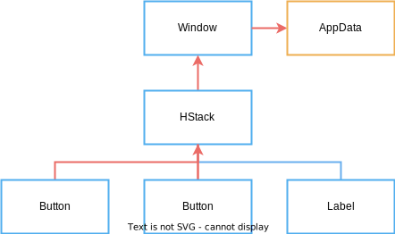

# Mutating State with Events

The label is now bound to the data so that it updates when the count changes, so now we need to hook up the buttons to change the count.

Vizia uses events to communicate actions to update model or view data. These events propagate through the tree, typically from the view which emits the event, up through the ancestors of the view, to the main window and through any models on the way.

## Declaring events

An event contains a message which can be any type, but is typically an enum. We'll declare an event enum with two variants, one for incrementing the count and one for decrementing:

```rust
pub enum AppEvent {
    Increment,
    Decrement,
}
```

## Emitting events
Events are usually emitted in response to some action on a view. This is where the first closure on the `Button` comes in. When the button is pressed this callback is called. We can use the provided `EventContext` to emit our events up the tree:

```rust
Button::new(cx, |ex| ex.emit(AppEvent::Decrement), |cx| Label::new(cx, "Decrement"))
    .class("dec");
Button::new(cx, |ex| ex.emit(AppEvent::Increment), |cx| Label::new(cx, "Increment"))
    .class("inc");
```

The flow of events from the buttons, up through the visual tree, to `AppData` model can be described with the following diagram, where the red arrows indicate the direction of event propagation:



## Handling events
Events are handled by views and models with the `event()` method of the `View` or `Model` traits. Let's fill in the `Model` implementation by implementing the `event` method:

```rust
impl Model for AppData {
      fn event(&mut self, cx: &mut EventContext, event: &mut Event) {
        event.map(|app_event, meta| match app_event {
            AppEvent::Decrement => self.count -= 1,
            AppEvent::Increment => self.count += 1,
        });
    }
}
```
Calling `map()` on an event attempts to cast the event message to the specified type and calls the provided closure if it succeeds.

The closure provides the message type and an `EventMeta`, which can be used to query the origin and target views of the event, or to consume the event to prevent it propagating further.

If we run the application now we can see that the buttons cause the state to mutate, which then causes the label to update.

<!-- // TODO: gif here -->
