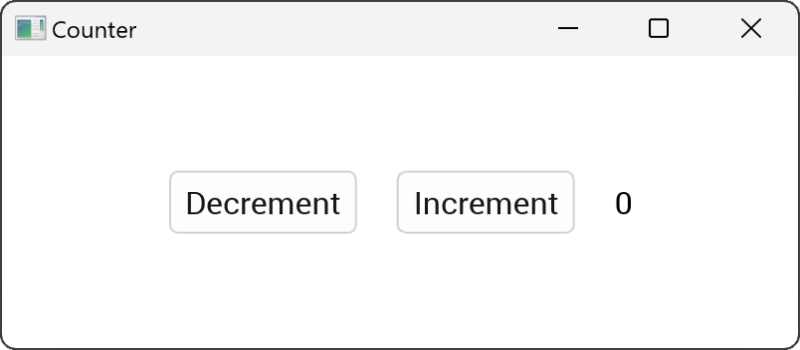

# Customizing the Layout

So far we have a horizontal row of buttons and a label, but they're positioned in the top left corner. Let's use layout modifiers to position the views in the center of the window with some space between them.

## Centering the views

By default the `HStack` view will stretch to fill its parent, in this case the window. We can center the contents of the `HStack` by applying stretch space around all of the children, which we can do using the `child_space()` modifier and setting it to `Stretch(1.0)`. Then we can add horizontal space between the children using the `col_between()` modifier:

```rust
use vizia::prelude::*;

fn main() {
    Application::new(|cx|{
        
        HStack::new(cx, |cx|{
            Button::new(cx, |_|{}, |cx| Label::new(cx, "Decrement"));
            Button::new(cx, |_|{}, |cx| Label::new(cx, "Increment"));
            Label::new(cx, "0");
        })
        .child_space(Stretch(1.0))
        .col_between(Pixels(20.0));
    })
    .inner_size((400, 100))
    .run();
}
```




## Understanding the layout system 
The layout system used by vizia is called [morphorm](https://github.com/vizia/morphorm) and can achieve results similar to flexbox on the web but with fewer concepts to learn. With morphorm there is only space and size. Vizia determines the position and size of views based on a number of layout properties which can be configured:

### Layout Type
The children of a view will be arranged into a stack. The `layout-type` property determines how children of a view will be arranged. There are two variants:
- `Row` - The view will arrange its children into a horizontal row.
- `Column` - The view will arrange its children into a vertical column.

### Position Type
The `position-type` property determines whether a view should be positioned in-line with its siblings in a stack, or out-of-line and independently of its siblings. There are two variants:
- `ParentDirected` - The view will be positioned relative to its in-line position with its siblings.
- `SelfDirected` - The view will be positioned out-of-line and relative to the top-left corner of its parent.

### Space
The position of an individual view within a stack can be adjusted by the spacing applied to each of its four sides:
- `left` - The space that should be applied to the left side of the view. This takes precedent over `right` spacing.
- `right` - The space that should be applied to the right side of the view.
- `top` - The space that should be applied to the top side of (above) the view. This takes precedent over `bottom` space.
- `bottom` - The space that should be applied to the bottom side of (below) the view.

The `space` property can be used to set the spacing on all four sides of a view simultaneously.

Spacing is specified with `Units`, which has four variants:
- `Pixels(val)` - Sets the spacing to a fixed number of pixels.
- `Percentage(val)` - Sets the spacing to a percentage of the view's parent size.
- `Stretch(factor)` - Sets the spacing to a proportion of the free space of the parent within the same axis.
- `Auto` - Sets the spacing to inherit the child spacing of the parent.

### Child Space
The `child space` property of a view can be used to apply space around its children by overriding the individual `Auto` spacing of the children and is also specified with `Units`. Child space can also be applied to individual sides of a view:
- `child_left` - The space that should be applied between the left side of the view and its children with individual `Auto` `left` spacing. Applies to all children in a vertical stack and to the first child in a horizontal stack.
- `child_right` - The space that should be applied between the right side of the view and its children with individual `Auto` `right` spacing. Applies to all children in a vertical stack and to the first child in a horizontal stack.
- `child_top` - The space that should be applied between the top side of the view and its children with individual `Auto` `top` spacing. Applies to all children in a horizontal stack and to the first child in a vertical stack.
- `child_bottom` - The space that should be applied between the bottom side of the view and its children with individual `Auto` `bottom` spacing. Applies to all children in a horizontal stack and to the first child in a vertical stack.

### Size
The size of a view is determined by its `width` and `height` properties, which are also specified with `Units`:
- `Pixels(val)` - Sets the size to a fixed number of pixels.
- `Percentage(val)` - Sets the size to a percentage of the view's parent size.
- `Stretch(factor)` - Sets the size to a proportion of the free space of the parent within the same axis.
- `Auto` - Sets the size to either hug the view's children, or to inherit the content size of the view, for example the size of any text within the view. Self-directed children do not contribute to the size of the view when the view size is set to auto.

The `width` and `height` can also be set simultaneously with the `size` property.

### Constraints
All spacing and size properties can be constrained with corresponding minimum and maximum properties, which are also specified using `Units`. For example, the `width` of a view can be constrained with the `min_width` and `max_width` properties.

