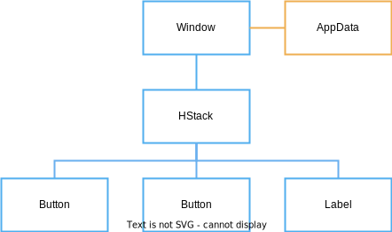

# Model Data

So far we've created the views for our counter application but we haven't declared the application data with the count value we want to display and modify.

Application data in Vizia is stored in models. Views can then bind to the data in these models in order to react to changes in the data.

## Declaring a model

A model definition can be any type, typically a struct, which implements the `Model` trait:

```rust
pub struct AppData {
    pub count: i32,
}

impl Model for AppData {}
```

## Building the model into the tree

To use a model, an instance of the data must be built into the application with the `build()` method:

```rust
use vizia::prelude::*;

fn main() {
    Application::new(|cx|{
        AppData { count: 0 }.build(cx); // Build the data into the app

        HStack::new(cx, |cx|{
            Button::new(cx, |_|{}, |cx| Label::new(cx, "Decrement"))
                .class("dec");
            Button::new(cx, |_|{}, |cx| Label::new(cx, "Increment"))
                .class("inc");
            Label::new(cx, "0")
                .class("count");
        });

    })
    .title("Counter")
    .inner_size((400, 200))
    .run();
}

```
This builds the model data into the tree, in this case at the root `Window`. Internally, models and views are stored separately, however, for processes like event propagation, models can be thought of as existing within the tree, with an associated view.

Therefore, the model-view tree for the above code can be depicted with the following diagram:



If the `AppData` had been built within the contents of the `HStack`, then the model would be associated with the `HStack` rather than the `Window`.