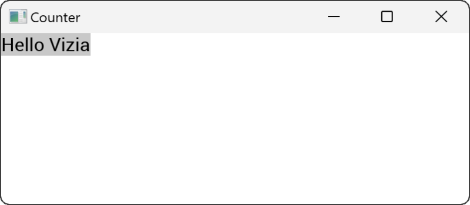
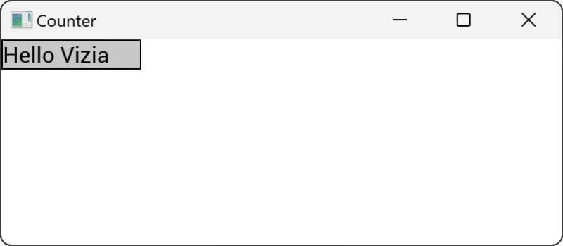

# Modifying Views

Modifiers are used to customize the appearance and behavior of views in a declarative way. Many of the built-in modifiers in Vizia can be applied to any View, which includes built-in views as well as user-defined views.

## Customizing the button with a modifier 

Applying modifiers to a view changes the properties of a view without rebuilding it. For example, we can use the `background_color()` modifier to set the background color of the label view:

```rust
Label::new(cx, "Hello Vizia")
    .background_color(Color::rgb(200, 200, 200));
```



Note how this overrides the default background color of the button, which is provided by a CSS stylesheet.

Multiple modifiers can be chained together to achieve more complex view configuration. Because modifiers are just changing the properties of a view, the order of modifiers is not important.

```rust
Label::new(cx, "Hello Vizia")
    .width(Pixels(200.0))
    .border_width(Pixels(1.0))
    .border_color(Color::black())
    .background_color(Color::rgb(200, 200, 200));
```



## View specific modifiers
Some views have modifiers which are specific to that view type. For example, the `Slider` view has a modifier for setting the slider `range`:

```rust
Slider::new(cx, AppData::value)
    .range(0.0..100.0);
```

View specific modifiers can still be combined with regular modifiers, and the order doesn't matter. Both of these produce the same result:

```rust
Slider::new(cx, AppData::value)
    .range(0.0..100.0)
    .width(Pixels(200.0));
```

```rust
Slider::new(cx, AppData::value)
    .width(Pixels(200.0))
    .range(0.0..100.0);
```

