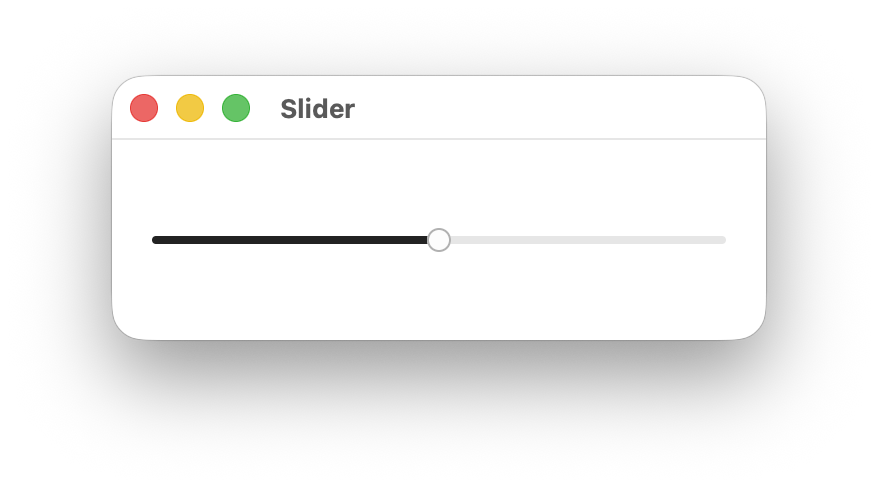
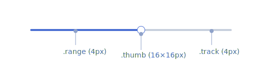
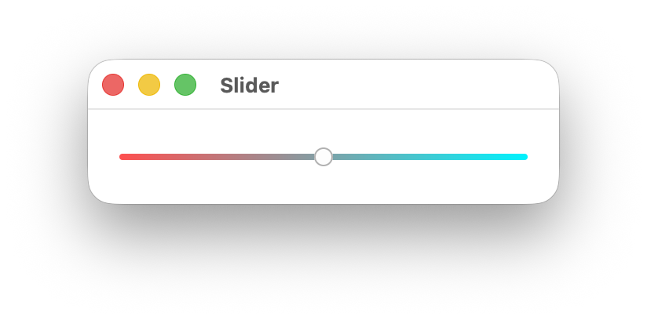

# Slider

An input where the user selects a value from within a given range.

<p align="center">

</p>

## When To Use It

Use Slider when you need users to select a specific value within a continuous range, such as volume, brightness, opacity, or other numeric parameters. Prefer sliders over spinboxes for values that benefit from visual representation of the range.

## Constructing a Slider

A `Slider` takes a binding to an `f32` value, normalized to the slider's range. By default the range is `0.0..1.0`.

```rust,ignore
let value = Signal::new(0.5f32);

Slider::new(cx, value)
    .on_change(|cx, val| println!("value: {val}"));
```

Use the `range` modifier to set a custom value range, the `vertical` modifier for a vertical layout, and `default_value` to control the value used when resetting the thumb:

```rust,ignore
Slider::new(cx, value)
    .range(-50.0..50.0)
    .default_value(0.0)
    .on_change(move |cx, val| cx.emit(AppEvent::SetValue(val)));

Slider::new(cx, value)
    .range(-50.0..50.0)
    .default_value(0.0)
    .on_change(move |cx, val| cx.emit(AppEvent::SetValue(val)))
    .vertical(true);
```

## Slider Modifiers

| Modifier | Type | Description | Default |
|---|---|---|---|
| `on_change` | `Fn(&mut EventContext, f32)` | Called with the new `f32` value whenever the slider is moved. | — |
| `range` | `impl Res<Range<f32>>` | The minimum and maximum value of the slider. | `0.0..1.0` |
| `vertical` | `impl Res<bool>` | Sets the slider to vertical layout when `true`. | `false` |
| `step` | `impl Res<f32>` | The increment used when moving the slider with the keyboard. | `0.01` |
| `default_value` | `impl Res<f32>` | Value restored when the thumb is double-clicked. | Initial bound value |

## Components and Styling

<p align="center">

</p>

A `Slider` is composed of the following sub-elements, each targetable by their CSS class name:

| Selector | Description |
|---|---|
| `slider` | The outermost container element. |
| `slider.vertical` | Applied when the orientation is `Vertical`. |
| `slider .track` | The background track that spans the full width of the slider. |
| `slider .range` | The filled portion of the track representing the current value. |
| `slider .thumb` | The draggable handle positioned at the current value. |

### Theming

| Selector | Property | Default Theme Token |
|---|---|---|
| `slider:focus-visible` | `outline-color` | `--ring` |
| `slider .track` | `background-color` | `--secondary` |
| `slider .range` | `background-color` | `--primary` |
| `slider .thumb` | `background-color` | `--primary-foreground` |
| `slider .thumb` | `border-color` | `--border` |

Customize slider appearance using CSS selectors and theme tokens. Here's an example with a gradient track and an invisible range:

```css
slider .track {
    background-image: linear-gradient(90deg, #4facfe 0%, #00f2fe 100%);
}

slider .range {
    background-color: transparent;
}
```

<p align="center">

</p>

## Accessibility

The slider has a role of `Slider` and exposes its current value, minimum, maximum, and step size to assistive technologies. Adheres to the [Slider WAI-ARIA design pattern](https://www.w3.org/WAI/ARIA/apg/patterns/slider/).

When the slider receives focus (via keyboard navigation), users can adjust the value using arrow keys or jump to the min/max with `Home` and `End`. Screen readers will announce the current value and range.

### Adding a Label

To associate visible text with a slider for assistive technologies, give the label an identifier and associate the slider with it using `.labeled_by`:

```rust,ignore
HStack::new(cx, |cx| {
    Label::new(cx, "Volume").id("volume_label");

    Slider::new(cx, value)
        .labeled_by("volume_label")
        .on_change(|cx, val| {
            cx.emit(AppEvent::SetValue(val));
        });
})
.height(Auto)
.gap(Pixels(8.0));
```

### Using `name` Without a Label

If you are not using a visible `Label`, provide an accessible name directly on the slider with `name`:

```rust,ignore
Slider::new(cx, value)
    .name("Volume")
    .on_change(|cx, val| {
        cx.emit(AppEvent::SetValue(val));
    });
```

Use this for icon-only or compact layouts where a separate text label is not present.

### Slider and Textbox with a Shared Label

When a slider is paired with a textbox (for direct numeric entry), link both controls to the same visible label using `labeled_by`:

```rust,ignore


HStack::new(cx, |cx| {
    Label::new(cx, "Volume").id("volume_label");

    Slider::new(cx, value)
        .labeled_by("volume_label")
        .on_change(|cx, val| {
            cx.emit(AppEvent::SetValue(val));
        });

    Textbox::new(cx, value)
        .labeled_by("volume_label");
})
.height(Auto)
.gap(Pixels(8.0));
```

This makes assistive technologies announce both controls with the same label context.

### Pointer Interaction

Users can interact with the slider using the pointer in three ways:

- Click on the slider track to move the value immediately to that position.
- Drag the thumb along the track to continuously update the value.
- Double-click the thumb to reset the slider to `default_value`.

Pointer updates are clamped to the configured `range` and aligned to the configured `step`, matching keyboard behavior.

### Keyboard Interaction

| Key | Action |
|---|---|
| `ArrowRight` / `ArrowUp` | Increment the value by one step. |
| `ArrowLeft` / `ArrowDown` | Decrement the value by one step. |
| `Home` | Set the value to the range minimum. |
| `End` | Set the value to the range maximum. |

