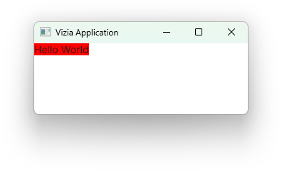
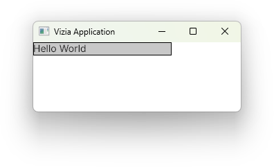

# Mofiying Views

Modifiers are used to customize the appearance and behaviour of views in a declarative way. Many of the built-in modifiers in Vizia can be applied to any View, which includes built-in views as well as user-defined views.

## Customize a view with a modifier 

Modifiers are functions which are called on a [`Handle`](https://docs.vizia.dev/vizia/view/struct.Handle.html), which is returned by the constructor of all views. Applying modifiers to a view changes the properties of a view without rebuilding it. For example, we can use the `background_color()` modifier to set the background color of a label view:

```rust
Label::new(cx, "Hello World")
    .background_color(Color::rgb(255, 0, 0));
```



Multiple modifiers can be chained together to acheieve more complex view configuration.

```rust
Label::new(cx, "Hello World")
    .width(Pixels(200.0))
    .border_width(Pixels(1.0))
    .border_color(Color::black())
    .background_color(Color::rgb(200, 200, 200));
```



## View specific modifiers
Some views have modifiers which are specific to that view type. For example, the `Slider` view has a modifier for setting the slider `range`:

```rust
Slider::new(cx, AppData::value)
    .range(0.0..100.0);
```

View specific modifiers can still be combined with regular modifiers, and the order doesn't matter. Both of these produce the same result:

```rust
Slider::new(cx, AppData::value)
    .range(0.0..100.0)
    .width(Pixels(200.0));
```

```rust
Slider::new(cx, AppData::value)
    .width(Pixels(200.0))
    .range(0.0..100.0);
```

## Modifier bindings
Many modifiers also accept a lens as well as a value. When a lens is supplied to a modifier, a binding is set up which will update the modified property when the bound to model data changes. For example:

```rust
#[derive(Lens)]
pub struct AppData {
    color: Color,
}

...

Label::new(cx, "Hello World")
    .background_color(AppData::color);
```