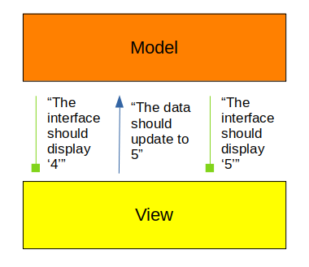

# What is Declarative UI?

The first thing to understand if you're reading this book from start to finish, is that your intuition for how to write a GUI program may not align with the way Vizia is designed.
This isn't to say that Vizia isn't intuitive to use, it just uses a paradigm which is not the same as the most common GUI frameworks.

Vizia is a _declarative UI framework_.
This means that there is a _very_ strict separation between models - that is, the data that you would like to manipulate as a user of your app - and views - that is, the presentation of that data, the way the interface looks and acts.
These two parts communicate with each other, and Vizia forces you to make this communication explicit.



The downward communication is called a _binding_, since the view is bound to reflect the model, and the upward communication is called an _event_, since it represents an instance of something happening that needs to be responded to.

The second thing to understand is that all user interface programming is about manipulating trees.
Look at the browser window you're reading this book in.
Logically, it has a root node (the browser window), with several children (the menu bar, the URL bar, the bookmark bar, and the webpage view).
Each of these children has children, and so on and so forth.
This is reflected in the way UI frameworks are designed - they let you build a tree of widgets, each of which has one parent and any number of children.

With all this in mind we can introduce Vizia's core abstraction.
Vizia lets you build a tree where each node has one view and any number of models attached.
In this world, bindings are attributes of an edge between two nodes, associated with some model further up the tree.


Events are not shown in this tree because events are transient - they start at some view, travel up the tree until they reach a model which can handle them, and then disappear after being handled.

The main thing to understand about the way bindings work is that when the model data that a binding is bound to changes, everything descending from that binding is chopped off the tree and rebuilt with the appropriate data.
This is why bindings are represented as slicing through the edges they are assigned to in the above diagram.

So now you should have at least a conceptual idea of how models, views, bindings, and events are part of Vizia's world of declarative user interface.
Let's put it to practice!

## Enough Talk... Have At You!

We're going to build the world's simplest app, a counter.
This app has a model (the current number), a binding (to that number), two events (increment/decrement), and four views (the window, a label indicating the current value - underneath the binding, and two buttons to increment and decrement the number - will emit the events).

Here's what the tree will look like:


Let's write it!

```rust
use vizia::*; // it's common practice to wildcard-import from vizia

// First, our model:

#[derive(Lens)]  // we'll get to what a lens is in a second. for now it can just be part of the way models work
pub struct AppData {
	number: i32,
}

// Then, our event:

pub enum AppEvent {
	Increment,
	Decrement,
}

// Now, how should the model respond to events?

impl Model for AppData {
	fn event(&mut self, _: &mut Context, event: &mut Event) {
		// there are hundreds of events. Is this event the kind we can handle?
		if let Some(message) = event.message.downcast::<AppEvent>() {
			// which event did we get?
			match message {
				AppEvent::Increment => self.number += 1,
				AppEvent::Decrement => self.number -= 1,
			}
		}
	}
}

// Now, let's build the tree.

fn main() {
	// Create a new application with a default window (our first view)
	let app = Application::new(WindowDescription::new(), |cx| {
		// cx is always Context where Vizia's retained state lives

		// Build our model with an initial value. This is attached to the current view.
		AppData { number: 0 }.build(cx);

		// Bind to `number`. This closure will be rerun whenever AppData::number changes.
		Binding::new(cx, AppData::number, |cx, number| {
			// The value we're passed is almost, but not quite,
			// the number we care about. Let's get it!
			let number = *number.get(cx);

			// Build our second view
			Label::new(cx, &number.to_string());
		});

		// Build our buttons.
		// Use cx.emit() to send events!
		Button::new(cx, |cx| cx.emit(AppEvent::Increment), |cx| Label::new(cx, "Increment"));
		Button::new(cx, |cx| cx.emit(AppEvent::Decrement), |cx| Label::new(cx, "Decrement"));
	});

	// run forever
	app.run();
}
```

Here's what it looks like!


A couple of things to note:

1) `cx` is passed absolutely everywhere, and always passed back to you as the first argument of each of your closures. This is the way a Vizia application is!
2) I lied a little bit; there are actually 6 views, since a button has no text of its own and instead has child views to render its contents.
3) Thanks to how ergonomic rust's closures are, the tree structure of our code actually matches pretty closely with our conceptual tree structure! Pretty cool!
