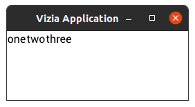
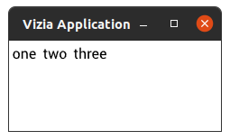
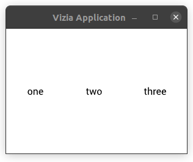

# Basic Styling

We've built the counter example, but it looks kind of weird.
Everything is arranged in the default way: vertically with no spacing.
Let's fix that!

Views in Vizia can be styled with CSS.
if you're familiar with HTML at all, you might be confused, because CSS is usually used for styling HTML.
However, as we discussed in the last section, GUI toolkits all have the commonality of needing to arrange elements in a tree in order to maintain a coherent hierarchy.
CSS can be used as a general tool to apply properties to elements arranged in a tree!

Just like HTML, you can style elements either with a stylesheet (a css file from the filesystem or embedded as a string), or with inline style attributes (rust code).
Vizia comes with a [built-in stylesheet](https://github.com/vizia/vizia/blob/main/core/src/default_theme.css) to make some things look better, but you'll definitely want to style things for yourself.

## Inline Styling

When you create a view, for example `Label::new()`, it returns a Handle, a reference to the view's entry in Vizia's tree.
You can use this handle to add style properties to a view.

```rust
Label::new(cx, "My text")
	.color(Color::rgba(0x56, 0xAA, 0xFF, 0xFF));
```

## Stylesheets

You can add your own CSS files with `cx.add_theme(string)` and `cx.add_stylesheet(filename)`.
The former takes an `&str` and the latter takes a filename which will be loaded from the filesystem.
You usually do this first thing in the new-application closure:

```rust
Application::new(WindowDescription::new(), |cx| {
	cx.add_stylesheet("my_style.css");
	// or
	cx.add_theme(r#"
		label {
			color: #56aaff;
		}
	"#);
});
```

If you load from the filesystem, you'll be able to use the F5 key in your application to reload the stylesheet without recompiling!
This is super convenient for prototyping, but adds an extra file that needs to be distributed with your application.

Of course, the above example will color every single label.
You can give the label a class, just like in HTML, and then apply styles to only elements with that class.

```rust
Label::new(cx, "My text")
	.class("my_class");
```

```css
.my_class {
	color: #56aaff;
}
```

## Layout

There is a special CSS property called `layout-type` which controls how children of that element are laid out - in a `row` or a `column`.
Fortunately, you don't have to specify a style property every time you want to lay out elements specially!
There are some very useful views called `HStack` and `VStack` which already have that style applied.
They're very easy to use!

```rust
HStack::new(cx, |cx| {
	Label::new(cx, "one");
	Label::new(cx, "two");
	Label::new(cx, "three");
});
```



How about adding spacing, so it looks like three distinct elements?
If you're familiar with HTML and CSS, you will know about the concepts of margin and padding.
Vizia doesn't have these - instead, there is a single concept to replace both of these: "space".
Space is blank space added outside an element, adding separation between itself and its siblings or parent.
Let's add three pixels of space around each label, using the following stylesheet:

```css
label {
	space: 3px;
}
```



Space can be applied to just one side using the `left`, `right`, `top`, and `bottom` styles.

Space can be applied to an element's children via some special styles on the parent: `child-space`, `child-left`, etc. all add space between a parent and its children on the specified side, while `row-between` and `col-between` adds vertical and horizontal space between children, respectively.

Finally, there is one last important feature that Vizia's CSS adds over HTML's CSS: the stretch unit.
In HTML, you can specify sizes and distances in units of pixels, percentage of parent size, and `auto`.
Vizia adds stretch: the notion that a given space should take up some proportion of the remaining space after all the prior measures have been summed up.
This solves a whole slew of layout problems which require one-off designations in HTML, notably related to centering and justifying content.
As an example, look what happens when we space the labels in the above example evenly, applying "1 stretch unit" around each of them:

```css
label {
	space: 1s;
}
```



Some final notes:

1) Names are converted between CSS selectors (snake_case), CSS attributes (kebab-case), rust methods (snake_case), and rust types (PascalCase) in the expected way.
2) We'll go in depth into the layout system and how it works later.
3) Vizia's layout system is inspired by [Subform](https://subformapp.com/). If you're interested in a talk describing the motivation behind its departures from HTML, you can watch [this video](https://www.deconstructconf.com/2017/kevin-lynagh-choosing-features).
4) You may notice that in the final gif there is twice as much space between each element as between the elements and their parent, since each between-area now has two stretch units applied to it, one from the side of each adjacent child. This is exactly the problem that `child-space` and `col-between` solve :)
